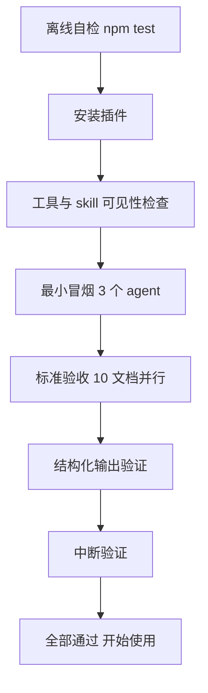

# 安装与运行验收清单

> 逐项打勾，全部通过即安装验收完成。遇到问题先查 [troubleshooting](troubleshooting.md)。
> 离线自检在插件源码目录执行（npm 用户可跳过第 1 步，直接用 npx 安装器）。

## 流程总览



## 1. 离线自检（仅源码仓库场景，不需要 OpenCode）

在插件仓库目录执行：

```bash
npm install
npm run typecheck   # 预期：无输出（通过）
npm test            # 预期：106 pass 0 fail
npm run build       # 预期：产出 dist/
```

## 2. 安装检查

启动 OpenCode，开新会话：

| 检查 | 操作 | 预期 |
|------|------|------|
| 工具可见 | 问 Main Agent："你现在有哪些工具？" | 列表含 `workflow`（含 `workflow_control`） |
| skill 可见 | 问："你有哪些 skills？" | 含 `workflow-authoring` |
| TUI 侧加载 | ctrl+p → Plugins | 本插件显示 active |
| 环境自检 | `npx @mickorz/opencode-dynamic-workflows doctor` | 无 FAIL |

## 3. 最小冒烟（3 个 agent）

对 Main Agent 原样粘贴（脚本同 [getting-started 第 4 步](getting-started.md)）：

```
用 workflow 工具执行以下脚本，原样执行不要改动：

export const meta = { name: 'smoke_test', description: '最小冒烟：3 个 agent' }

phase('Scan')
const info = await agent('列出你当前目录下的文件，只输出前 10 行')

phase('Echo')
const results = await parallel([
  () => agent('用一句话说明什么是工作流编排'),
  () => agent('用一句话说明什么是确定性重放'),
])
return { info, results }
```

**通过标准**：头部显示 `3 个 agent` 且无失败；3 行摘要全部 `[成功]`；`## 结果` 里 `{ info, results }` JSON 完整。参考量级（作者环境实测，数值因模型而异）：约 600 tok / 12s。

## 4. 标准验收（10 个文档并行分析）

在 `examples/sample-project` 目录启动 OpenCode（该目录自带 10 个标准验收集 mdx），对 Main Agent 说：

```
读取 scripts/acceptance-10docs.js 的内容，用 workflow 工具原样执行，不要改动脚本
```

逐项检查：

| 检查 | 操作 | 预期 |
|------|------|------|
| 并行完成 | 看工具输出头部 | `10 个 agent` 以上全部成功，含 token 总数 |
| 摘要完整 | 看 agent 摘要 | 每行 label 是文件名，各带 token 数 |
| 汇总产出 | 看 `## 结果` | 一页文档总览（共同主题、API 清单、注意事项） |
| 上下文隔离 | 回主会话看消息历史 | **只有**一次 workflow 调用 + 一份结果，无任何子会话中间过程 |
| 子会话可追溯 | 父会话内 subagent 导航切换 | 能看到各子会话，各自只有自己的分析内容 |

**上下文隔离一项是本插件存在的意义，务必确认**。两个预期现象（不是 bug）：Main Agent 通常只指"见上方 JSON 输出"而不复述内容；综合 agent 收到的拼接输入属于子会话，主上下文永远看不到。

## 5. 结构化输出验证

```
用 workflow 工具执行以下脚本，原样执行不要改动：

export const meta = { name: 'schema_test', description: '结构化输出验证' }

const report = await agent('分析当前目录的 package.json，输出名称、版本、依赖数量', {
  label: '结构化分析',
  schema: {
    type: 'object',
    properties: {
      name: { type: 'string' },
      version: { type: 'string' },
      dependencyCount: { type: 'number' }
    },
    required: ['name', 'version', 'dependencyCount']
  }
})
return report
```

**通过标准**：`## 结果` 里的 JSON 严格符合 schema（三字段齐全、类型正确），而非自然语言。

**已知限制**：结构化输出依赖模型/网关支持 tool_choice required；不支持的网关会返回 400（agent 0 token 失败、结果为 null、摘要含 provider_bad_request）。此为 provider 能力问题，换支持的模型即可——见 [troubleshooting](troubleshooting.md)。

## 6. 中断验证

1. 重新执行第 4 步脚本，分析阶段进行中（agent 摘要还在增长时）按 **Esc**
2. 检查：工具结果显示工作流被用户中断；subagent 导航下运行中的子会话停止产生新内容
3. **过 1 分钟再看**：没有子会话仍在继续跑（不消耗 token）即通过

## 7. 检查点清单

- [ ] `npm test` 通过（106 pass，源码仓库场景）
- [ ] `workflow` 工具与 `workflow-authoring` skill 在 OpenCode 中可见
- [ ] 冒烟 3 agent 全部成功
- [ ] 10 文档验收全部成功，汇总产出一页总览
- [ ] 主会话上下文无子会话过程（隔离确认）
- [ ] schema 模式返回符合 schema 的 JSON（或确认是 provider 能力限制）
- [ ] Esc 中断无孤儿会话
- [ ] （用了后台/续跑的话）`workflow_control status` 可见 run，`resumeFromRunId` 回放 `[缓存]` 行
