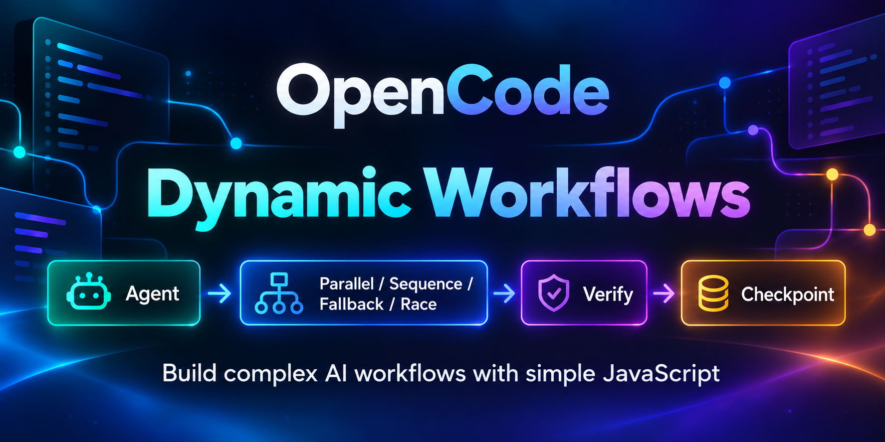
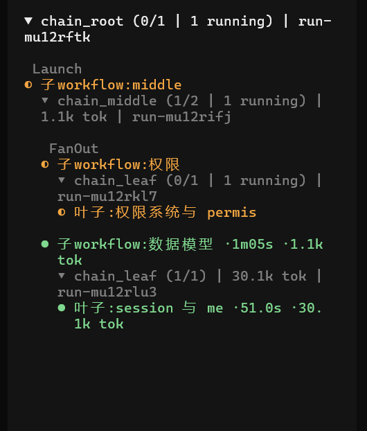

# OpenCode Dynamic Workflows

[](https://www.npmjs.com/package/@mickorz/opencode-dynamic-workflows)
[](https://www.npmjs.com/package/@mickorz/opencode-dynamic-workflows)
[](https://github.com/mickorz/opencode-dynamicworkflows/stargazers)
[](./LICENSE)

**English** | [简体中文](./README.zh-CN.md)

[快速开始](#5-分钟快速开始) · [组合控制流](#组合控制流composite-control-flow) · [进阶用法](docs/zh-CN/how-to-guides.md) · [配置](docs/zh-CN/configuration.md) · [排障](docs/zh-CN/troubleshooting.md) · [定时任务](docs/zh-CN/how-to-guides.md#定时任务schedule) · [DSL 参考](https://github.com/mickorz/opencode-dynamicworkflows/blob/main/skills/workflow-authoring/references/runtime.md) · [Issues](https://github.com/mickorz/opencode-dynamicworkflows/issues)

OpenCode 动态工作流编排。

用多代理、并行执行、组合控制流、质量验证、人工确认点与可复用子工作流，构建复杂 AI 工作流。



## 特性一览

- 🤖 多代理工作流
- ⚡ 并行执行
- 🔀 组合控制流
- ✅ 质量验证
- 👤 人工确认点
- 🧩 子流程与嵌套工作流
- 🔌 OpenCode 原生集成

> 一句话：Main Agent 生成一段 JavaScript 编排脚本，由 Runtime 在 VM 沙箱中执行，通过 `agent() / parallel() / sequence() / fallback() / race()` 将任务分发给大量独立子会话并行处理，脚本内汇总后仅把最终结果返回主上下文——解决大批量并行任务的主上下文污染问题。底层基于 OpenCode v1 插件 API。

## 30 秒了解

**问题**：让 AI 并行分析 20 个文件时，20 个子任务的过程和结果会全部涌入主会话上下文，很快挤爆窗口、拖慢后续对话。

**方案**：你用自然语言提需求 → Main Agent 自动生成一段编排脚本 → 插件在沙箱里执行它，把任务分发给几十个独立子会话并行跑 → 主会话只收到一份汇总结果 + 每个子任务的耗时与 token 统计。运行期间 TUI 侧边栏还有实时进度树：


点击树上任意节点进入**节点详情视图**：直接查看该 agent 的最终结果（文本或 JSON 美化展示，结构化输出不再是一片空白），附执行元数据（模型、耗时、token、子会话）与 Open Session 入口回看执行过程。

**嵌套工作流**：`agentType: 'general'` 的子代理本身也能再调 `workflow` 工具，把多层 workflow 串联成一个大流程（如 根 workflow -> 中间层并行扇出 -> 多个叶子 workflow）。每层嵌套 run 独立计量 token 与耗时，并在 TUI 侧边栏以**层级树**呈现——嵌套子树直接挂在触发节点名下，逐级缩进：



> [!TIP]
> **你不需要会写代码**。编排脚本由 Main Agent 按内置 skill 自动生成；想深入时再参考 [workflow-authoring DSL 参考](https://github.com/mickorz/opencode-dynamicworkflows/blob/main/skills/workflow-authoring/references/runtime.md)。

## 前提条件

1. **OpenCode v1 已安装**，且配置了可用的 provider/模型（能正常对话）。未安装见 [OpenCode 官方文档](https://opencode.ai/docs/)。
2. **Node.js 18+ 与 npm**：仅运行安装器（npx）和 npm 操作时需要；插件本体由 OpenCode 内置运行时加载，不依赖本机 Node。
3. Windows 用户请在 **PowerShell 或 cmd** 中运行 npx 命令（git-bash 下 npm 的 bin 转发有兼容问题）。

## 安装

一条命令（在任意目录运行，交互式完成配置合并与 skill 安装，原配置自动留 .bak 备份）：

```powershell
npx @mickorz/opencode-dynamic-workflows install
```

安装完成后**重启 OpenCode** 生效。三种安装方式（全局 / 当前项目 / 锁定版本）的详细说明见 [docs/configuration.md](docs/zh-CN/configuration.md)。

配套命令：

```powershell
npx @mickorz/opencode-dynamic-workflows update      # 升级到最新
npx @mickorz/opencode-dynamic-workflows uninstall   # 交互式卸载
npx @mickorz/opencode-dynamic-workflows doctor      # 环境排查（只读）
```

## 5 分钟快速开始

**第 1 步：验证安装。** 重启 OpenCode 后，对 Main Agent 说：

```
你有哪些工具？
```

工具列表里应出现 `workflow`（问"你有哪些 skills"应看到 `workflow-authoring`）。也可以运行 `npx @mickorz/opencode-dynamic-workflows doctor` 查看环境检查清单。

**第 2 步：跑第一个工作流。** 对 Main Agent 说（原样粘贴）：

```
用 workflow 工具执行以下脚本，原样执行不要改动：

export const meta = { name: 'smoke_test', description: '最小冒烟：3 个 agent' }

phase('Scan')
const info = await agent('列出你当前目录下的文件，只输出前 10 行')

phase('Echo')
const results = await parallel([
  () => agent('用一句话说明什么是工作流编排'),
  () => agent('用一句话说明什么是确定性重放'),
])
return { info, results }
```

**第 3 步：看懂结果。** 工具返回大致如下（数值因模型而异）：

```
工作流 smoke_test 完成：3 个 agent，耗时 11.6s，共 612 tokens（runId: run-xxxxxxx）
阶段: Scan > Echo

agent 摘要:
  [成功] <任务名> (Scan) 120 tok ($0.0012)
  [成功] <任务名> (Echo) 96 tok ($0.0009)
  [成功] <任务名> (Echo) 88 tok ($0.0008)

## 结果
{ "info": "...", "results": ["...", "..."] }
```

三个 agent 全部 `[成功]`、`## 结果` 里有完整 JSON，即跑通。也可以直接说自然语言让 Main Agent 自己生成脚本，例如：

```
用 workflow 并行分析 docs 目录下所有 markdown 文件，然后汇总成一份要点清单
```

**进阶一步：指定模型与结构化返回。** 子任务可指定模型（换成你配置里可用的），并用 schema 约束返回格式：

```
用 workflow 工具执行以下脚本，原样执行不要改动：

export const meta = { name: 'model_schema_demo', description: '指定模型 + schema 约束返回' }

const SCHEMA = { type: 'object', properties: { ok: { type: 'boolean' }, summary: { type: 'string' } }, required: ['ok', 'summary'] }
const r = await agent('读取当前目录下的 package.json，用一句话总结它的作用', { model: 'openai/gpt-4o-mini', schema: SCHEMA })
return r
```

`r` 直接是 JSON 对象（`r.ok`、`r.summary` 可直接访问），不用自己解析文本。更多见 [how-to-guides](docs/zh-CN/how-to-guides.md) 的「使用不同模型编排」与「schema 结构化返回」两章。

**再进一步：超时与重试。** 慢任务单设超时，可恢复失败（含超时）自动重试：

```
用 workflow 工具执行以下脚本，原样执行不要改动：

export const meta = { name: 'timeout_retry_demo', description: '单 agent 超时与重试' }

// 60 秒硬超时，可恢复失败自动重试 2 次（共 3 次尝试）
const r = await agent('分析 docs 目录并输出要点清单', { label: 'docs分析', timeoutMs: 60000, retries: 2 })
return r
```

要点：`timeoutMs` 毫秒，省略则不设硬超时；`retries` 上限 3，超时属于可重试失败；也可在工具入参里传 `agentTimeoutMs` / `agentRetries` 给整次 run 设缺省，单 agent 的 `timeoutMs` / `retries` 优先。详见 [how-to-guides](docs/zh-CN/how-to-guides.md) 的「超时与重试」章。

**同一个脚本带参数重跑：args。** 脚本里读全局 `args`，口令末尾追加参数，脚本不用改：

```
用 workflow 工具执行 scripts/node-detail-ab-test.js，原样执行不要改动，
args 传 {"model": "biangfeng-gateway/glm-5.2"}
```

脚本侧接收（缺省回退，参数可省）：`const modelOptions = {}; if (args && typeof args.model === 'string') modelOptions.model = args.model`，再把 `...modelOptions` 展开进 `agent()` 选项。沙箱禁用 `Date.now()` / `Math.random()`，外部值（列表、路径、时间戳）都从 `args` 注入。详见 [how-to-guides](docs/zh-CN/how-to-guides.md) 的「带参数执行」章。

## 效果展示

| 实时工作流树（阶段、agent、耗时、token） | 嵌套工作流层级树 |
| --- | --- |
|  |  |

<!-- TODO: 补充截图——组合控制流分组行（[Sequence]/[Race] 与 checkpoint 等待人工确认状态）、节点详情视图；格式：
|  |  |
-->

## 核心概念

- **子会话隔离**：每个 agent 是独立子会话，父会话内用 subagent 导航可查看各自完整过程；主会话只有汇总。
- **缺省只读**：`agent()` 默认用只读的 explore 子代理；需要写文件的任务显式传 `agentType: 'general'`。
- **嵌套工作流**：general 子代理可再调 `workflow` 工具串联多层大流程，TUI 侧边栏层级树显示（嵌套子树挂触发节点下），详见 [how-to-guides](docs/zh-CN/how-to-guides.md) 的「嵌套工作流」章。
- **后台与续跑**：脚本参数 `background: true` 立即返回 runId 不阻塞对话；中断后 `resumeFromRunId` 可断点续跑，已完成的 agent 不再重复消耗 token。
- **质量助手**：`verify`（对抗式验证）/ `judgePanel`（评审团选优）/ `retry`（有界重试）/ `checkpoint`（人工确认点，拒绝即强停止）。
- **组合控制流**：`sequence` / `fallback` / `race` / `check` 四个组合节点，与 `parallel` 构成统一控制模型，TUI 侧边栏按组合层级分组显示。

## 功能一览

- `workflow` 自定义 tool + `workflow_control` 控制 tool（status / stop）
- Schedule 定时任务：`/schedule 每小时执行 xxx.js` 自然语言创建，到点确定性执行（不经 LLM 判断）；同项目多开 OpenCode 不重复执行；执行记录可查
- VM 沙箱确定性护栏（禁 `Date.now()` / `Math.random()` / import / require，可确定性重放）
- DSL：`agent / parallel / pipeline / phase / log / args` + 质量助手 + 组合控制流 `sequence / fallback / race / check`（+ 确定性 helper `fileExists / commandSuccess`）
- 原生结构化输出（`schema` 走 OpenCode `format: json_schema`）、并发控制（缺省 CPU 核数-2、上限 16）、超时/重试/abort 级联、git worktree 隔离、journal 断点续跑、后台运行
- 原生子工作流 `workflow()`：脚本内直接组合子流程（`await workflow('./sub.js', args)` 或按注册名 `workflow('daily-review')`），不经 LLM 转发；一个 run 共享并发配额/中断/journal，父可纯编排；同脚本多实例靠 label 区分
- 子流程观测：结果自带子流程 wall-clock 耗时与 token 统计（多配置对比以 wall-clock 为准）；TUI 按子流程分组子树显示
- Workflow Registry：`.opencode-workflows/workflows/` 下的脚本按 `meta.id ?? meta.name` 全局引用，与 Schedule 的 workflowId 同一体系（同一脚本可定时也可被组合）
- 嵌套工作流（旧方案，legacy）：general 子代理内再触发 `workflow` 工具，每层独立 run/journal/token 计量

### 组合控制流（Composite Control Flow）

四象限统一模型——所有组合节点接收函数数组，节点内可嵌套任意其他节点：

|          | 全部执行                                | 选一个                          |
| -------- | --------------------------------------- | ------------------------------- |
| 串行     | `sequence`（prev 链传递，返回末节点值） | `fallback`（依次尝试，首成功返） |
| 并行     | `parallel`（结果保序，失败槽位 null）   | `race`（首成功胜出并取消其余）   |

```javascript
// 多级降级：快模型不行换强模型；结构性错误（拼错脚本名等）上抛不被吞掉
const result = await fallback([
  () => workflow('./fast.js'),
  () => workflow('./strong.js'),
])
if (!result) return '全部降级路径失败'

// 四层验证链：AI 执行 -> 确定性检查 -> AI 质量评审 -> 人工闸门
await sequence([
  () => agent('修改 src/login.ts', { agentType: 'general' }),
  () => check(() => commandSuccess('npm run build'), '编译必须通过'),
  (prev) => verify(prev, { reviewers: 2 }),
  () => checkpoint('验证完成，是否发布？'),
  () => workflow('./publish.js'),
])
```

语义规则（详见 workflow-authoring skill）：

- **执行态与业务结果分离**：节点返回任意值（含 `null` / `{ok:false}`）都是执行成功，业务否决自己写 if
- **可恢复失败返回 null**：与 `agent()` 可恢复失败同构，`if (!r)` 判断即可；结构性错误（脚本拼错/嵌套超限/非函数数组）直接上抛
- **Human Reject 强停止**：`checkpoint` 被拒绝抛 `CHECKPOINT_REJECTED`，不会被 fallback 换候选、不会塌缩为 null；resume 时拒绝确定性重现（改 prompt 文本才会重问）
- **race 局部取消**：胜出后其余候选（含其子工作流内 agent）被局部中止，不影响 root
- **journal 透明**：组合节点不占 callIndex，resume 行为与普通 await 链一致
- **TUI 组合树**：侧边栏显示 `[Sequence]` / `[Race]` 分组行与 checkpoint 状态（等待人工确认/已批准/被拒绝），区分「等人工」与「卡死」

### Schedule 定时任务的产品边界（设计而非缺陷）

> [!NOTE]
> - **OpenCode 必须运行**：TUI 关闭期间任务不执行，重开后自动恢复。
> - **错过 = 跳过**：休眠/关机错过的时间点不补跑，下一个未来时间点正常执行。
> - **多实例安全**：同项目开多个 OpenCode，每个时间槽至多触发一次（原子 claim 协调）。
> - 执行语义为 at-most-once per slot；workflow 需人工 checkpoint 的场景不适合定时跑（会直接失败）。

用法见 [docs/how-to-guides.md](docs/zh-CN/how-to-guides.md) 的定时任务一节。

各功能用法见 [docs/how-to-guides.md](docs/zh-CN/how-to-guides.md)。

## 文档地图

| 文档 | 内容 |
|------|------|
| [docs/getting-started.md](docs/zh-CN/getting-started.md) | 从 0 到第一个工作流的完整教程 |
| [docs/configuration.md](docs/zh-CN/configuration.md) | 三种安装方式、配置字段、升级与卸载 |
| [docs/troubleshooting.md](docs/zh-CN/troubleshooting.md) | 常见问题排查 |
| [docs/how-to-guides.md](docs/zh-CN/how-to-guides.md) | 模型编排、schema 结构化、后台运行、断点续跑、质量 DSL、worktree 隔离 |
| [docs/testing.md](docs/zh-CN/testing.md) | 安装与运行验收清单 |
| [docs/development.md](docs/zh-CN/development.md) | 贡献者指南（架构、测试、本地联调、发布） |
| [workflow-authoring DSL 参考](https://github.com/mickorz/opencode-dynamicworkflows/blob/main/skills/workflow-authoring/references/runtime.md) | 全部 DSL API 的权威细节 |

## Star History

[](https://star-history.com/#mickorz/opencode-dynamicworkflows&Date)

## 联系方式

项目定制需求可联系。

邮箱：[490113806@qq.com](mailto:490113806@qq.com)

## License

MIT

> 同步基线：v0.11.0（英文版 [README.md](./README.md) 为源，改英文后需同步本文件）
