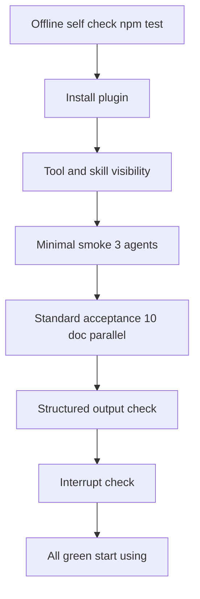

# Install & Run Acceptance Checklist

[**English**](./testing.md) | [简体中文](./zh-CN/testing.md)

> Tick the items one by one; all passing means installation acceptance is done. Hit a problem? Check [troubleshooting](troubleshooting.md) first.
> The offline self-check runs in the plugin source repo (npm users can skip step 1 and use the npx installer directly).

## Overview



## 1. Offline Self-Check (source-repo only; no OpenCode needed)

In the plugin repository:

```bash
npm install
npm run typecheck   # expect: no output (pass)
npm test            # expect: 106 pass 0 fail
npm run build       # expect: dist/ produced
```

## 2. Installation Checks

Start OpenCode, open a new session:

| Check | Action | Expected |
| ----- | ------ | -------- |
| Tool visible | Ask the Main Agent: "What tools do you have?" | List includes `workflow` (and `workflow_control`) |
| Skill visible | Ask: "What skills do you have?" | Includes `workflow-authoring` |
| TUI side loaded | ctrl+p → Plugins | This plugin shows active |
| Environment check | `npx @mickorz/opencode-dynamic-workflows doctor` | No FAIL |

## 3. Minimal Smoke (3 agents)

Paste to the Main Agent as-is (same script as [getting-started step 4](getting-started.md)):

```
Execute the following script with the workflow tool, exactly as-is:

export const meta = { name: 'smoke_test', description: 'minimal smoke: 3 agents' }

phase('Scan')
const info = await agent('List the files in your current directory, output only the first 10 lines')

phase('Echo')
const results = await parallel([
  () => agent('Explain workflow orchestration in one sentence'),
  () => agent('Explain deterministic replay in one sentence'),
])
return { info, results }
```

**Pass criteria**: header shows `3 agents` with none failed; all 3 summary lines `[ok]`; `## Result` contains the complete `{ info, results }` JSON. Ballpark (measured on the author's setup; varies by model): ~600 tok / 12s.

## 4. Standard Acceptance (10 Documents in Parallel)

Start OpenCode in the `examples/sample-project` directory (it ships 10 standard-acceptance mdx files) and tell the Main Agent:

```
Read the contents of scripts/acceptance-10docs.js and execute it as-is with the workflow tool; do not modify the script
```

Check item by item:

| Check | Action | Expected |
| ----- | ------ | -------- |
| Parallel completion | Tool output header | `10 agents` all successful, with a token total |
| Complete summary | Agent summary section | One line per file-name label, each with token counts |
| Synthesized output | `## Result` | A one-page document overview (common theme, API list, caveats) |
| Context isolation | Message history in the main conversation | **Only** one workflow call + one result; zero sub-session intermediate output |
| Sub-sessions traceable | Switch via subagent navigation in the parent session | Each sub-session visible, containing only its own analysis |

**Context isolation is the reason this plugin exists — verify it without fail.** Two expected behaviors (not bugs): the Main Agent usually just points at "the JSON output above" without restating it; the concatenated input given to the synthesis agent belongs to the sub-session and is never visible in the main context.

## 5. Structured Output Check

```
Execute the following script with the workflow tool, exactly as-is:

export const meta = { name: 'schema_test', description: 'structured output check' }

const report = await agent('Analyze package.json in the current directory; output name, version, dependency count', {
  label: 'structured-analysis',
  schema: {
    type: 'object',
    properties: {
      name: { type: 'string' },
      version: { type: 'string' },
      dependencyCount: { type: 'number' }
    },
    required: ['name', 'version', 'dependencyCount']
  }
})
return report
```

**Pass criteria**: the JSON in `## Result` strictly conforms to the schema (all three fields present, correct types) — not natural language.

**Known limitation**: structured output requires the model/gateway to support tool_choice required; unsupported gateways return 400 (the agent fails at 0 tokens, result is null, summary shows provider_bad_request). That's a provider capability issue — switch to a supporting model; see [troubleshooting](troubleshooting.md).

## 6. Interrupt Check

1. Re-run the step-4 script; during the analysis phase (agent summary still growing) press **Esc**
2. Check: the tool result shows the workflow interrupted by the user; running sub-sessions under subagent navigation stop producing content
3. **Look again after a minute**: no sub-session still running (burning tokens) — pass

## 7. Final Checklist

- [ ] `npm test` passes (106 pass, source-repo scenario)
- [ ] `workflow` tool and `workflow-authoring` skill visible in OpenCode
- [ ] 3-agent smoke all successful
- [ ] 10-document acceptance all successful with a one-page synthesized overview
- [ ] Main-conversation context free of sub-session chatter (isolation confirmed)
- [ ] Schema mode returns schema-conforming JSON (or confirmed as a provider limitation)
- [ ] Esc interrupt leaves no orphan sessions
- [ ] (If using background/resume) `workflow_control status` shows the run; `resumeFromRunId` replays with `[cached]` lines
