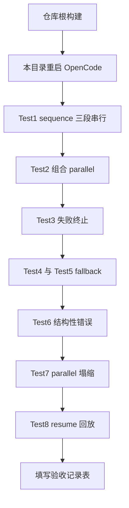

# Composite 控制流 V1（sequence / fallback）手动测试指南

> 验收 P0 交付：`sequence()` / `fallback()` 组合节点与 child 失败中止面修正（分支 feat/composite-control-flow，commit 99c3c38..eeedf67）。
> **前置（缺一不可，缺了第一报 `sequence is not defined`）：**
> 1. 仓库根 `npm run build`（改 src 后必须重建，dist 才含新 globals）
> 2. **退出并重启 OpenCode**（插件进程缓存旧 dist，不重启重建也不生效）
> 本目录已内置全部验收脚本（`scripts/composite/`），按下列 Test 逐项执行。
> 对应需求：`Docs/01_需求与规划/Composite控制流开发计划V1.md` 的 P0 部分。

## 本轮验收要回答的三个问题

1. sequence / fallback 在真实 LLM 会话里是否按三态规则工作（success / failure / cancelled / 结构性上抛）
2. journal / resume 对 sequence 是否透明（key 不漂移、回放不漏）
3. child 脚本 throw 不再污染整 run 中止面（fallback 换候选、parallel 塌缩 null、父 try-catch 可续行）



---

## Test 1：sequence 三段串行（与旧写法实机对照）

```
读取 scripts/composite/seq_parent.js 的内容，用 workflow 工具原样执行（scriptPath 传 scripts/composite/seq_parent.js，前台执行），把返回 JSON 结果字段原样贴出
```

**通过标准**：
- 返回含 `lastNodeValue.code`（伪代码文本）与 `chain` 字段——三个 child 的结果经 prev 链传递：`1_spec.js` 的返回整体作为第二个节点的入参，节点内取 `spec.brief` 下发
- 与 `scripts/native/pipeline_parent.js`（旧 await 链写法）结果语义等价：两者都产出 brief/design/code 链
- 父脚本零 agent（纯编排），全程仅 3 次 LLM 调用
- `.opencode-workflows/journal/` 新增**一个** run 文件，3 条 entry 的 key 形如 `run-xxx:wf0:0`、`run-xxx:wf1:0`、`run-xxx:wf2:0`——**sequence 自身不产生额外 journal 记录**（这是 journal 透明的核心判定）
- TUI 会话树仍显示 `▸ native_spec / 需求概述` 等三组（sequence 不改变 observability 结构）

## Test 2：sequence 节点内组合 parallel

```
用 workflow 工具前台执行 scripts/composite/seq_parallel_parent.js，把返回 JSON 原样贴出
```

**通过标准**：
- 返回 `laneCount: 2`，`briefs` 两项均为文本——parallel 节点收到 sequence 传入的 prev（`'视角种子'` 字符串），节点内 `seed + '-A'` 求值成功即传递生效
- 实例隔离的确定性验证（LLM 不一定在回答里回显视角编号，看 journal）：`.opencode-workflows/journal/` 最新 run 文件中两条 entry 的 prompt 字段分别含 `视角种子-A` 与 `视角种子-B`，key 为 `wf0:0` / `wf1:0` 按声明顺序编号

## Test 3：sequence 可恢复失败立即停止

```
用 workflow 工具前台执行 scripts/composite/seq_fail_parent.js，把返回 JSON 原样贴出
```

**通过标准**：
- `seqResult: null` 且 `isNull: true`——第二个节点 throw 后序列停止，**不是**抛错杀 run
- `seen: ["a", "b"]`——第三个节点未执行
- `after: "STOP-CHECK"`——sequence 返回 null 后父脚本照常继续（与 `agent()` 可恢复失败返回 null 的语义对齐）
- run 日志含 `sequence[1] 失败，序列停止` 字样

## Test 4：fallback 首个候选成功即返回

```
用 workflow 工具前台执行 scripts/composite/fb_first_parent.js，把返回 JSON 原样贴出
```

**通过标准**：
- `winner: "fast"`——纯 JS 候选直接成功
- `after: "AFTER-FAST"`——fallback 结束后父脚本继续
- 第二个候选（1_spec.js 含 agent）完全跳过的确定性验证：journal 仅 1 条 entry（后置 agent，key 形如 `runId:0`），**无任何 `wf` 开头的 entry**（若第二候选执行过会留下 `wf0:0`）
- 注：脚本必须含至少一次真实 agent 调用（纯编排校验），纯 JS 胜者 + 零 agent 的 run 会被拒——这是设计行为，脚本内用后置 agent 满足

## Test 5：fallback 候选为 child workflow，失败换下一候选（poisoning 修正核心）

```
用 workflow 工具前台执行 scripts/composite/fb_child_parent.js，把返回 JSON 原样贴出
```

**通过标准**：
- `winner.brief` 是 `1_spec.js`（tag 为 FALLBACK 视角）的产出——第一个候选 `error_child.js` 脚本 throw 后，**第二个候选照常执行并胜出**
- `after: "AFTER-FALLBACK"`——fallback 结束后父脚本继续，run 没有被 child 失败污染成 aborted
- run 日志含 `workflow("error_child") 失败` 与 `fallback[0] 失败，尝试下一候选`
- 对照（可选）：在 v0.9.0 旧版本上跑同脚本会直接整 run 失败——这就是本次修正的实机差异

## Test 6：结构性错误必须上抛（fallback 不吞编程错误）

```
用 workflow 工具前台执行 scripts/composite/fb_structural_parent.js，贴出报错原文
```

**通过标准**：
- workflow 工具**失败**，报错含 `不存在或不可读`——拼错的子脚本名是结构性错误，不允许被 fallback 伪装成"降级到 backup 候选"
- 返回 JSON 中**没有** `winner: "backup"`（第二个候选从未执行）

## Test 7：parallel 内 child 失败塌缩为 null（行为修正确认）

```
用 workflow 工具前台执行 scripts/composite/par_child_fail_parent.js，把返回 JSON 原样贴出
```

**通过标准**：
- `len: 2`、`failedLane: "collapsed-null"`——`error_child.js` 的槽位是 null 而非杀 run
- `okLane` 含 SIBLING 视角的 brief——兄弟分支不受失败分支影响
- 对照：v0.9.0 上此脚本整 run 失败（child throw 污染 `shared.aborted`，parallel 的塌缩逻辑被短路）

## Test 8：resume 下 sequence 内 agent 全量回放

> 结构关键：脚本里 sequence（callIndex 0/1）在前、可变的父 agent（callIndex 2）在后。改父 prompt 只触发 firstMiss=2，sequence 内两个 agent 因前缀未变而回放。若顺序颠倒（父在前），同 scope 后续全部重跑，测不到回放。

1. 前台执行 `scripts/composite/seq_resume_parent.js`，记下返回 JSON 里的 `runId`
2. 让 Main Agent 修改脚本：把 `PARENT-PROBE` 改成 `PARENT-PROBE-2`（只动 sequence 之后的父 agent，不动 sequence 内 prompt）
3. 续跑：`resumeFromRunId=<刚才的 runId>` + 修改后的脚本（先改文件再续跑）

**通过标准**：
- 父的 agent 重跑（结果含 `PARENT-PROBE-2`）
- sequence 内两个 agent **从 journal 回放**：`SEQ-NODE-1` 原文不变，第二个 agent 的返回仍是首跑的复述文本（回放结果作为 prev 链路不变）
- 本次 run 的 token 消耗只有父那一次 agent 的量级
- journal 中 entry 的 key 为 `runId:0`、`runId:1`、`runId:2` 连续编号——sequence 不占 callIndex（若出现 `runId:4` 之类的漂移即失败）

## Test 9（P1）：race 多路竞争，慢路被局部取消

> 前置：切到 feat/composite-control-flow 分支并重建（npm run build）+ 重启 OpenCode

```
用 workflow 工具前台执行 scripts/composite/race_parent.js，把返回 JSON 原样贴出
```

**通过标准**：
- `winner` 是快路 agent 的短回答（如“4”），不是慢路的 500 字报告——首个成功胜出
- `after: "AFTER-RACE"`——race 后父脚本继续，run 未被局部取消波及
- run 日志含 `race[1] 胜出，取消其余 1 个候选`
- TUI / agent 记录中慢路 agent 终态为 aborted（被局部 signal 取消，非 root abort）

## Test 10（P1）：race + fallback + sequence 三层组合

```
用 workflow 工具前台执行 scripts/composite/race_fallback_parent.js，把返回 JSON 原样贴出
```

**通过标准**：
- `result` 有值（快判→方案生成链正常，或规则兜底生效）
- 三层嵌套不报结构性错误；journal key 连续无漂移

## Test 11（P2）：TUI 组合树显示（Composite 分组行）

> 前置：重建 + 重启后执行（P2-3 的渲染在 TUI 侧）

```
用 workflow 工具前台执行 scripts/composite/race_fallback_parent.js，执行期间与完成后观察左侧 sidebar 树
```

**通过标准**：
- sidebar 中 agent 行上方出现 `[Sequence]` / `[Race]` / `[Fallback]` 组合分组行（中括号粗体，区别于子流程行）
- 嵌套组合（race 内的慢路 child）正确缩进；退出组合后不残留
- 组合行不影响节点选中/Node Detail（jk 导航仍只落在 agent 行）
- 对照：journal key 无 cmp 前缀（组合寻址与 journal 严格分离）

---

## 排查清单

| 症状 | 原因 | 处置 |
|------|------|------|
| `sequence is not defined` | 改 src 后没重建，或重建后没重启 OpenCode | 仓库根 `npm run build` → 退出 OpenCode → 本目录重新启动（两步都要） |
| 可用全局列表里没有 sequence/fallback | 插件加载的是旧 dist（同上） | 同上；可用 `ls dist/runtime/node-contract.js` 确认新产物存在 |
| Test 5 整 run 失败 | 插件未加载新构建（poisoning 修正未生效） | 仓库根 `npm run build` 后重启 |
| Test 8 回放不命中 | 脚本修改触发了 journal miss（预期行为是父 agent 重跑） | 确认只改了 PARENT-PROBE 字样，未动 sequence 内 prompt |
| Test 6 返回了 winner | fallback 吞了结构性错误 | 记录为缺陷（违反三态契约） |
| TUI 树缺 child 分组 | observability 回归 | 记录为缺陷 |

## 验收记录表

| Test | 结果 | 备注 |
|------|------|------|
| 1 sequence 三段串行 | [x] 2026-09-24 过 | journal 3 entry 无额外记录，key wf0/1/2 |
| 2 组合 parallel | [x] 2026-09-24 过 | journal prompt 确证 tag A/B 隔离，key 保序 |
| 3 失败终止返回 null | [x] 2026-09-24 过 | seen=[a,b]，after=STOP-CHECK |
| 4 fallback 首选成功 | [x] 2026-09-24 过 | journal 仅 1 entry 无 wf 记录（第二候选未执行） |
| 5 fallback child 换候选 | [x] 2026-09-24 过 | poisoning 修正核心：error_child throw 后 FALLBACK 视角胜出，run 未污染 |
| 6 结构性错误上抛 | [x] 2026-09-24 过 | 报「不存在或不可读」，未降级到 backup |
| 7 parallel 塌缩 null | [x] 2026-09-24 过 | failedLane=collapsed-null，SIBLING 兄弟分支照常完成 |
| 8 resume 全量回放 | [x] 2026-09-24 过 | run-mudwgz4e：sequence 回放 SEQ-NODE-1 逐字一致，父 agent 重跑 -2 |

全部通过。过程中两处脚本修正：Test4 补后置 agent（纯编排校验边界）；Test8 结构反转（sequence 在前可变 agent 在后，否则同 scope 后续全重跑）。
