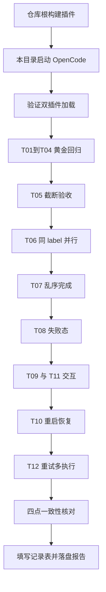

# Node Inspector 节点详情与结果展示验收测试指南（T01~T12）

> 测试工程：examples/sample-project（在本目录启动 OpenCode）
> 验收对象：点击 workflow 节点进入的 Node Detail 全屏视图（结果展示 / 空态 / 截断 / Open Session）
> 对应需求：Docs/01_需求与规划/TUI节点详情与结果展示需求.md 的 T01~T12 测试矩阵（第一版 = FR-1~FR-6 + FR-7 数据结构）
> 前置阅读：本指南假定插件已按实现计划落地并通过全部单元测试（npm test）

---

## 目录

1. [背景与判定原则](#1-背景与判定原则)
2. [测试流程总览](#2-测试流程总览)
3. [前置条件](#3-前置条件)
4. [通用操作与界面词汇](#4-通用操作与界面词汇)
5. [T01到T04 黄金回归](#5-t01到t04-黄金回归)
6. [T05 大结果截断](#6-t05-大结果截断)
7. [T06 并行同 label](#7-t06-并行同-label)
8. [T07 乱序完成](#8-t07-乱序完成)
9. [T08 失败态](#9-t08-失败态)
10. [T09 运行中点击与 T11 Open Session](#10-t09-运行中点击与-t11-open-session)
11. [T10 重启恢复](#11-t10-重启恢复)
12. [T12 重试多 execution](#12-t12-重试多-execution)
13. [数据一致性四点核对](#13-数据一致性四点核对)
14. [自动化覆盖对照表](#14-自动化覆盖对照表)
15. [排查清单](#15-排查清单)
16. [验收记录表与报告落盘](#16-验收记录表与报告落盘)

---

## 1. 背景与判定原则

已定案事实：`agent()` 传 schema 时，OpenCode 注入 StructuredOutput 工具，结果经 tool call 返回，
assistant 消息无 text part。因此**子会话正文空白是合法形态，本需求不让 Session 不再空白，
而是让 Result 有正确的展示位**（Node Detail 视图）。

A/B 定义：

- A = 旧展示路径（node -> 原生 session -> assistant text）：schema 场景必然空白
- B = 新展示路径（node -> Node Detail -> result，可选 Open Session 回看过程）：本指南全部用例验收 B 路径

黄金判定（T01 五条同时满足才 PASS）：

```
assistant text part = 0        （合法，不做任何修改）
StructuredOutput 存在          = true
workflow result 存在           = true
journal result 存在            = true
Node Detail 中 result 可见     = true
```

## 2. 测试流程总览



## 3. 前置条件

| 项 | 检查方式 | 说明 |
|----|----------|------|
| 插件已构建 | 仓库根 `npm install && npm run build`，存在 `dist/index.js` | server 入口读 dist |
| TUI 实现文件已生效 | 本目录重启 OpenCode 后，命令面板 Plugins 中 `opencode-dynamic-workflows` 为 active | npm 安装方式下 src/tui 新文件必须已登记 IMPLEMENTATION_FILES 并重新安装/构建，否则 TUI 静默失败（无 sidebar 或无详情视图） |
| opencode.json / tui.json | 本目录已有，均指向 `../..` | 双形态插件 |
| 模型可用 | 会话默认模型可正常对话；如需 T03/T04，确认目标模型 provider 已配置（`provider/modelId` 形式） | 模型名以本机配置为准 |
| docs 语料 | 本目录 docs/ 下 10 个 mdx 存在 | 全部脚本的阅读材料 |

## 4. 通用操作与界面词汇

- 打开列表：命令面板（ctrl+p）执行 **Open workflow view**，或直接观察 sidebar 实时树
- 进入节点详情：在列表（或 sidebar）**点击任意节点行**
- Node Detail 键位：`Enter` / `o` 打开该节点的子会话（Open Session）；`Esc` / `q` 返回上一界面；正文用滚轮滚动
- 三种空态文案（判定时严格对照）：
  - 运行中无结果：`No result yet`
  - 已完成无结果：`No result returned`
  - 失败：Error 区块显示错误消息（前缀 `Error: `）
- 截断提示文案：`Result truncated, original size: xx KB`
- 预览兜底提示：`（快照预览，journal 未写入完整结果）`（journal 不可用时 Result 来自快照 2KB 预览）
- Header 信息：label、状态图标与状态文字、agent 类型、model、耗时、token（合计含 in/out 拆分）、sessionID、runId、executionId；
  多次执行时显示「第 N 次执行」；journal 回放节点显示「缓存回放」；prompt 摘要在 Header 下方暗色显示

统一执行口令（对 Main Agent 说，脚本名按用例替换）：

```
读取 scripts/<脚本名>.js 的内容，用 workflow 工具原样执行，不要改动脚本
```

注意：脚本文件被修改过再跑时（如 T07 修正定义序后重跑），必须在口令里强调**重新读取文件**，
否则 Main Agent 可能沿用上轮记忆中的旧内容执行：

```
scripts/<脚本名>.js 已修改，请重新读取文件内容，用 workflow 工具原样执行，不要改动脚本
```

## 5. T01到T04 黄金回归

脚本：`scripts/node-detail-ab-test.js`（schema-reader 走结构化路径 + text-reader 走文本路径）。

| 用例 | 模型 | schema | 操作 |
|---|---|---|---|
| T01 | 会话默认（建议 flash 类小模型） | 有 | 跑脚本，等完成 |
| T02 | 会话默认 | 无 | 同一次运行内 text-reader 即 T02 |
| T03 | 其他模型（`args` 传 `{"model": "<provider/modelId>"}`） | 有 | 换模型重跑 |
| T04 | 其他模型 | 无 | 同一次 T03 运行内 text-reader |

T01 判定表：

| 编号 | 判定标准 | 怎么看 |
|---|---|---|
| 1 | 子会话正文形态合法（插件未伪造正文） | Node Detail 内按 Enter 进 Open Session：正文为空（flash 类模型）**或**仅有模型自然产生的过程叙述（会唠叨的模型，如 glm-5.2）均合法——定案文档：正文有无取决于模型习惯；锚点是最终结果在 StructuredOutput 工具条目里，而非正文 |
| 2 | StructuredOutput 存在 | 同一会话里可见 StructuredOutput 工具调用痕迹（或以第 3、4 条为准） |
| 3 | workflow result 存在 | workflow tool 返回文本「结果」区有 structured JSON（含 ok/summary 字段） |
| 4 | journal result 存在 | `.opencode-workflows/journal/<runId>.json` 中 `entries["<runId>:0"].result` 含 ok/summary |
| 5 | Node Detail 可见 | 点击 schema-reader 节点，Result 区显示 pretty-print JSON，字段完整，非 undefined/空 |

T02 判定：text-reader 节点 Node Detail 显示一句话原文（非 JSON），与 Open Session 里的 assistant 正文一致。
T03/T04 判定：同 T01/T02，仅换模型。若网关不支持 json_schema 自动降级（tool 输出日志尾部有降级提示），
Node Detail 的结果仍可见且按 JSON pretty-print 呈现（降级路径同样 PASS）。

## 6. T05 大结果截断

脚本：`scripts/node-detail-large-result-test.js`。

| 编号 | 判定标准 |
|---|---|
| 1 | long-output 节点正文被截断，末尾出现 `Result truncated, original size: xx KB`，xx 大于 20 |
| 2 | long-structured 节点显示 pretty-print JSON 且同样截断（截断发生在 JSON.stringify 之后，末尾允许是不完整 JSON） |
| 3 | 打开即响应，滚轮滑动流畅，无卡死、无崩溃 |
| 4 | Header 数据（耗时/token 含 in/out 拆分）正常显示 |

## 7. T06 并行同 label

脚本：`scripts/node-detail-parallel-labels-test.js`（20 个节点共用 label "scan"）。

| 编号 | 判定标准 |
|---|---|
| 1 | 列表出现 20 个 "scan" 节点，每个节点 id 唯一（形如 `<runId>:0` 到 `<runId>:19`） |
| 2 | 逐个打开：Prompt 与 Result 指向同一份文档（结果句中出现的文档名与该节点 prompt 一致），无串位 |
| 3 | tool 返回的 results 数组（20 条）与各节点 journal result 一一对应（第 i 条 = 节点 `:i`） |
| 4 | journal 文件中 20 个 key 全部唯一、20 个 result 互不混淆 |

## 8. T07 乱序完成

脚本：`scripts/node-detail-out-of-order-test.js`（定义序为 重/中/轻，完成序预期为 轻/中/重——颠倒反差）。

| 编号 | 判定标准 |
|---|---|
| 1 | 运行中三个节点都出现，各自独立从 running 翻转为 ok（轻任务最先完成但排在列表最后，重任务最后完成但排在最前） |
| 2 | 列表顺序始终按定义序（重/中/轻）排列，不因完成顺序换位 |
| 3 | 每个节点完成后 Result 各自正确出现，内容与该节点 prompt 对应（结果数组按定义序返回） |
| 4 | 无跨节点的内容串写（轻任务节点只有 quick，不出现文档总结内容） |

## 9. T08 失败态

脚本：`scripts/node-detail-failed-test.js`（1 成功 + 1 立即超时 + 1 超时且重试 1 次）。

| 编号 | 判定标准 |
|---|---|
| 1 | 两个失败节点 Node Detail 显示 Error 区块（含 timeout 相关错误消息），不崩溃 |
| 2 | Result 区不出现 undefined / [object Object] |
| 3 | 对照组节点正常显示结果，两种节点互不影响 |
| 4 | 超时失败B（retries:1）journal 中该节点 executions 有 2 条尝试记录 |

## 10. T09 运行中点击与 T11 Open Session

脚本：`scripts/node-detail-running-click-test.js`（约 2-4 分钟，观察窗口充足）。

T09 步骤与判定：

1. 脚本运行中（观察A/B 尚为 running）点击 观察A 节点进 Node Detail
2. 判定：显示 Header（running 态图标 + sessionId 已回填）+ Result 区 `No result yet`
3. 等待其完成，**不退出不重进**：1-2 秒内 Header 状态翻转为完成、Result 自动出现（自动刷新 PASS）

T11 步骤与判定：

1. 在已完成节点的 Node Detail 内按 Enter（Open Session）
2. 判定：跳转的子会话 sessionID 与 Node Detail Header 显示的 sessionID 完全一致；会话列表未新增会话
3. 在子会话内返回（Esc 到上一界面），再进 /workflow 找到该节点：Node Detail 仍正常
4. Esc 从 Node Detail 返回列表正常

## 11. T10 重启恢复

无需专用脚本。步骤：

1. 跑 `scripts/node-detail-ab-test.js` 至完成，记住 tool 返回里的 runId
2. 完全退出 OpenCode，重新在本目录启动，回到原会话
3. 打开 /workflow，找到历史 run，点击 schema-reader 节点

| 编号 | 判定标准 |
|---|---|
| 1 | 重启后历史 run 树仍可见（快照终态或 metadata 兜底） |
| 2 | Node Detail 的 Result 从 journal 恢复，与重启前展示一致（四点核对见第 13 节） |
| 3 | text-reader 节点同样可看 |

补充场景（快照已被清理）：同会话再跑一个新 run（新 run 启动会清理旧终态快照），旧 run 的树从
sidebar 消失；此时旧节点的 Node Detail 已不可达（入口消失），但 journal 文件仍在磁盘上，
`resumeFromRunId` 续跑不受影响——这是设计内行为，不算 FAIL。

## 12. T12 重试多 execution

脚本：`scripts/node-detail-retry-test.js`。

| 编号 | 判定标准 |
|---|---|
| 1 | 节点最终 failed，Node Detail 显示 Error（最新一次尝试的错误），UI 不展示中间尝试 |
| 2 | journal 文件该节点 entry 的 `executions` 数组有 4 条：attempt 1..4、全部 failed、executionId 形如 `<runId>:0:1` 到 `<runId>:0:4`，互不覆盖 |
| 3 | entry 无 hash/result 字段（失败不进结果缓存）；下一次 resume 该节点会重跑而非回放 |
| 4 | 「重试后成功」子场景由单元测试覆盖（fake runner 注入），真机不强制验收 |

## 13. 数据一致性四点核对

每个用例完成后，对 schema-reader（或任一目标节点）核对四处相等，不允许出现 `[object Object]` / `undefined`：

```
1. workflow tool 返回值里该节点的结果（脚本 return 的对象字段）
2. Node Detail Result 区展示值
3. .opencode-workflows/journal/<runId>.json 中该节点 entry.result
4. 快照 .opencode-workflows/runs/<runId>.json 中该 agent 的 outputPreview（前 2KB 应与完整值前缀一致，敏感键除外）
```

journal 查看方法（文件为整段 JSON，version=1）：

```
键 = "<runId>:<callIndex>"（callIndex 从 0 起按脚本内 agent() 调用顺序）
```

## 14. 自动化覆盖对照表

| 用例 | 真机手工（本指南） | 单元测试已覆盖（npm test） |
|---|---|---|
| T01~T04 | 必须（真实模型与 StructuredOutput 链路） | adapter 双路径返回形状、降级路径包装 |
| T05 | 交互与卡顿观测 | 20KB 截断、UTF-8 边界、redact、空态四分支 |
| T06 | TUI 视觉核对 | node.id/journal key 唯一性、parallel 保序（node-execution-e2e） |
| T07 | TUI 顺序与翻转观测 | 乱序完成下 record 状态独立性（node-execution-e2e） |
| T08 | Error UI 观测 | failed record.error 传递、executions 落盘 |
| T09 | 必须（交互） | running 态 sessionId 回填、journal 轮询刷新逻辑（run-snapshot/reader 系列） |
| T10 | 必须（进程重启） | journal-reader 对旧/坏文件的宽松解析 |
| T11 | 必须（交互） | 无 |
| T12 | journal 数据核对 | 重试 execution 记录、executions 合并、失败不进 resume（workflow-journal） |

## 15. 排查清单

| 现象 | 可能原因 | 处置 |
|---|---|---|
| 点节点无反应或视图空白 | src/tui 新文件未登记 IMPLEMENTATION_FILES（npm 安装方式），或有文件漏复制 | 重新 `npm run build` 后重装/重启；确认 TUI 插件 active；跑 tests/tui-vendor-files.test.ts |
| Node Detail 一直 No result returned 但 journal 有值 | runId/nodeId 传参错误；journal 文件名与 runId 不符 | 核对 tool 返回 runId 与 journal 文件名一致 |
| Node Detail 一直 No result yet 且不刷新 | 快照失联（server 侧异常）或轮询未启动 | 查看 `.opencode-workflows/runs/<runId>.json` 是否持续更新 |
| Open Session 跳错会话 | sessionId 与节点不一致 | 记录 Header sessionID 与实际跳转 ID，回报问题 |
| schema 节点结果为 null | 模型未返回结构化内容（info.structured 为空） | 属模型侧问题；Node Detail 显示 No result returned 为正确行为 |
| 全部用例 journal 无 executions | 插件为旧版本（未含 onAgentExecution 落盘） | 确认版本后重跑 |
| Windows 控制台查看 journal 中文乱码 | GBK 控制台读 UTF-8 文件 | 用编辑器或 python（encoding='utf-8'）查看，乱码不代表数据损坏 |

## 16. 验收记录表与报告落盘

验收记录表（逐用例填写）：

| 用例 | 模型 | 判定条目 | 预期 | 实际 | PASS/FAIL | 备注 |
|---|---|---|---|---|---|---|
| T01 | | 1~5 | 见第 5 节 | | | |
| T02 | | 结果可见 | | | | |
| T03 | | 1~5 | | | | |
| T04 | | 结果可见 | | | | |
| T05 | | 1~4 | | | | |
| T06 | | 1~4 | | | | |
| T07 | | 1~4 | | | | |
| T08 | | 1~4 | | | | |
| T09 | | 3 步 | | | | |
| T10 | | 1~3 | | | | |
| T11 | | 1~4 | | | | |
| T12 | | 1~4 | | | | |

结果报告落盘：`examples/sample-project/.opencode-workflows/test-reports/node-detail-ab-test-<日期>.json`
（目录不存在则手工创建；发布前必须全 PASS，T01 永久保留为回归用例）

```json
{
  "date": "2026-09-10",
  "pluginVersion": "0.2.2",
  "cases": [
    {
      "id": "T01",
      "model": "<provider/modelId>",
      "expected": ["assistant text part = 0", "StructuredOutput = true", "workflow result = true", "journal result = true", "Node Detail 可见 = true"],
      "actual": "五条全部满足；Node Detail 展示 {ok: true, summary: \"...\"}",
      "passed": true
    }
  ],
  "allPassed": true
}
```
