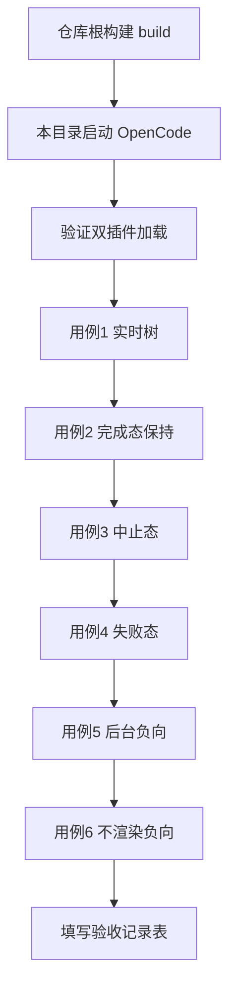

# TUI 增强 F-20 验收测试指南（MVP-1 前台通道）

> 测试工程：examples/sample-project（在本目录启动 OpenCode）
> 验收对象：sidebar 实时 workflow 树（前台 metadata 通道）
> 对应需求：Docs/TUI增强需求文档.md v0.2 的 TA-01a / TA-02 / TA-05 / TA-06 / TA-07
> 前置阅读：本指南假定插件已按需求文档实现并通过 70 个单元测试

---

## 目录

1. [测试流程总览](#1-测试流程总览)
2. [前置条件](#2-前置条件)
3. [启动与加载验证（TA-05 TA-06 TA-07）](#3-启动与加载验证)
4. [用例 1 实时树（TA-01a）](#4-用例-1-实时树)
5. [用例 2 完成态保持（TA-02）](#5-用例-2-完成态保持)
6. [用例 3 中止态](#6-用例-3-中止态)
7. [用例 4 失败态](#7-用例-4-失败态)
8. [用例 5 后台 run 负向验证](#8-用例-5-后台-run-负向验证)
9. [用例 6 无 workflow 会话不渲染](#9-用例-6-无-workflow-会话不渲染)
10. [排查清单](#10-排查清单)
11. [验收记录表](#11-验收记录表)

---

## 1. 测试流程总览



## 2. 前置条件

| 项 | 检查方式 | 说明 |
|----|----------|------|
| 插件已构建 | 仓库根 `npm run build`，存在 `dist/index.js` | server 插件入口 |
| TUI 依赖已装 | 仓库根 `node_modules/solid-js` 存在，版本 1.9.12 | TUI 渲染依赖（已随 npm install 完成） |
| opencode.json | 本目录已有，`plugin: ["../.."]` | server 侧（现有） |
| tui.json | 本目录新增，`plugin: ["../.."]` | TUI 侧（本次新增，独立于 opencode.json） |

## 3. 启动与加载验证

步骤：

1. 在本目录启动 OpenCode
2. `ctrl+p` 打开命令面板，选 **Plugins**，确认 External 下列出 `opencode-dynamic-workflows` 且状态为 active（这是 TUI 侧，来自 tui.json）
3. 问 Main Agent："你有哪些工具？"——确认有 `workflow`（这是 server 侧，来自 opencode.json）

判定：

| 编号 | 判定标准 | 对应验收 |
|------|----------|----------|
| TA-05 | opencode.json 与 tui.json 都指向本包，两侧均 active | 双插件配置 |
| TA-06 | TUI 插件经 tui.json 加载，无任何 OpenCode 源码改动 | 不 fork |
| TA-07 | 无 Plugin.define / ctx.storage / session.next 等面 | v1 only |

注意：`opencode debug info` 只回显配置声明，不反映运行时是否真的加载成功，不能作为加载证据。

## 4. 用例 1 实时树

对 Main Agent 说：

```
读取 scripts/tui-progress-test.js 的内容，用 workflow 工具原样执行，不要改动脚本
```

脚本内容：4 个并行文档分析（Analyze 阶段）+ 1 个汇总（Summarize 阶段），全程前台阻塞约 1-2 分钟。

运行期间观察右侧 sidebar，预期出现如下形态（示意）：

```
+--------------------------------------+
| ▼ Dynamic Workflow tui_progress      |
|   (0/5 | 4 running)                  |
|                                      |
| Analyze                              |
|   ◐ config                           |
|   ◐ agents                           |
|   ◐ custom-tools                     |
|   ◐ commands                         |
|                                      |
| (Todo)                               |
| (Files)                              |
+--------------------------------------+
```

判定：

| 检查点 | 预期 |
|--------|------|
| section 位置 | LSP 之后、Todo 之前（order 350） |
| 标题行 | 名称 + 完成计数 (0/5)，运行中附 `4 running` |
| phase 分组 | Analyze 标题行 + 其下 4 个节点 |
| 图标 | 运行中 ◐（黄），完成后逐个变 ●（绿） |
| 实时性 | 节点完成后图标与计数随之变化，无需任何操作 |
| 耗时 | 完成的节点行尾出现 `·12.3s` 形式的耗时 |
| 阶段推进 | 4 个分析完成后出现 Summarize 标题行与"汇总"节点 |

对应验收 TA-01a。

## 5. 用例 2 完成态保持

用例 1 的 workflow 自然结束后观察：

| 检查点 | 预期 |
|--------|------|
| section 不消失 | 侧栏仍显示 Dynamic Workflow |
| 终态 | 标题 `(5/5)`，全部节点 ● |
| 折叠 | 点击标题行（鼠标）在折叠/展开间切换，折叠后只留一行 |
| 持久 | 在会话内继续对话、上下滚动，section 保持显示最终态 |

对应验收 TA-02（完成态经 tool 返回值 metadata 快照落盘）。

## 6. 用例 3 中止态

再次执行 scripts/tui-progress-test.js，在 Analyze 阶段多数节点仍是 ◐ 时按 `Esc` 中断：

| 检查点 | 预期 |
|--------|------|
| tool 返回 | 中断摘要（含 resumeFromRunId 续跑提示） |
| sidebar 终态 | 保留中止快照：已完成的仍为 ●，被中断的节点为 ○（灰） |
| 计数 | 标题行的完成计数停留在中断时刻（不足 5/5） |
| 不复跑 | sidebar 不再变化（无永久转圈） |

## 7. 用例 4 失败态

执行 scripts/tui-failure-test.js（每个 agent 1ms 超时，几秒内结束）：

| 检查点 | 预期 |
|--------|------|
| 图标 | 节点显示 ✖（红） |
| 错误行 | 节点下方 `↳ agent "..." 超时 (1ms)...` 形式的错误摘要（灰） |
| tool 返回 | 正常返回（可恢复失败塌缩为 null，不算 workflow 失败） |

## 8. 用例 5 后台 run 实时树（v0.3 起为正向验收）

对 Main Agent 说：

```
读取 scripts/tui-progress-test.js 的内容，用 workflow 工具原样执行，加参数 background true
```

判定（v0.3 镜像通道落地后，后台与前台同构实时树）：

| 检查点 | 预期 |
|--------|------|
| tool 返回 | 立即返回 runId，不阻塞 |
| sidebar | 执行期间实时树稳定显示（与前台同构：phase 分组、◐ 变 ●、计数推进）——agent 间隙不消失（3 秒心跳保障） |
| 终态 | 完成后树保留终态；结果以消息形式发回本会话（P2 能力不回归） |

历史：v0.2 期为负向预期（后台不渲染）；v0.3 镜像通道后转正向，对应 TA-01b。

## 9. 用例 6 无 workflow 会话不渲染

1. 新建会话（不执行任何 workflow）
2. 观察 sidebar：无 Dynamic Workflow section
3. 回到用例 1 的旧会话：section 恢复显示该会话的终态

判定：无 workflow tool part 的会话不渲染（FindPart 返回空即不渲染，不占 sidebar 空间）。

## 10. 排查清单

sidebar 没出现 Dynamic Workflow 时按序检查：

| 序 | 检查 | 方式 |
|----|------|------|
| 1 | tui.json 是否存在且指向仓库根 | 本目录 tui.json，`plugin: ["../.."]`；注意 tui.json 不会从 opencode.json 继承，必须独立配置 |
| 2 | 是否重启过 OpenCode | 配置只在启动时读取，改完 tui.json 必须退出重启 |
| 3 | TUI 侧是否 active | ctrl+p → Plugins，看 External 列表；不在则 tui.json 没被读到 |
| 4 | dist 是否最新 | 仓库根 `npm run build`（server 侧改动后需要；TUI 侧读 src 源码不需要） |
| 5 | 是不是后台 run | 后台同样出实时树（v0.3 起）；若后台不出树而前台正常，检查 runs 目录快照是否在写（server 侧需重启加载新 dist） |
| 6 | 会话里有没有 workflow tool part | 前台成功执行过至少一次 workflow 才有数据 |
| 7 | 前台执行但整棵树不动 | 网关或模型响应慢；看聊天区 tool part 是否在转圈；若 tool 已结束而树仍 running，回报 bug（附 runId） |

## 11. 验收记录表

| 用例 | 验收项 | 结果 | 备注 |
|------|--------|------|------|
| 3 | TA-05 双插件配置 | 待测 | |
| 3 | TA-06 不 fork | 待测 | 无 OpenCode 源码改动 |
| 3 | TA-07 v1 only | 待测 | |
| 4 | TA-01a 前台实时树 | 待测 | 图标/分组/计数/实时性 |
| 5 | TA-02 完成态保持 | 待测 | 含折叠 |
| 6 | 中止态快照 | 待测 | |
| 7 | 失败态展示 | 待测 | ✖ 与错误行 |
| 8 | TA-01b 后台实时树 | 待测 | v0.3 起正向 |
| 9 | 空会话不渲染 | 待测 | |
| 12 | MVP-2 sidebar 点击进子会话 | 待测 | |
| 13 | MVP-3 workflow 全屏路由 | 待测 | 键盘导航 |

---

## 12. 用例 12 MVP-2 sidebar 节点点击进子会话（TA-03）

前置：用例 1 已跑过（会话里有 workflow 树）。

步骤：鼠标点击 sidebar 树中某个已完成的 agent 节点行（带耗时的 ● 行）。

判定：

| 检查点 | 预期 |
|--------|------|
| 导航 | 进入该 agent 的子会话（标题与节点 label 一致） |
| 子会话页脚 | 底部显示 subagent footer（Parent 与 Prev 与 Next 可用） |
| 返回 | footer 的 Parent 链接回主会话 |

说明：运行中（◐）与已完成（●）节点均可点（sessionId 建会话即有）；journal 回放的节点无 sessionId 不可点。sidebar 无逐节点键盘选中机制（宿主限制），键盘导航在用例 13 的全屏路由。

## 13. 用例 13 MVP-3 workflow 全屏路由（TA-04）

前置：在跑过 workflow 的会话内。

步骤：ctrl+p 打开命令面板，选 Open workflow view（或输入 /workflow 触发 slash 命令）。

判定：

| 检查点 | 预期 |
|--------|------|
| 打开 | 全屏展示 workflow 树（phase 分组 + 节点行含 tokens 与 Enter 进入标记） |
| 键盘 | j/k 或 上下键移动 ▸ 选中标记，回绕 |
| 实时 | 后台或前台 workflow 运行中打开时，树随进度刷新 |
| Enter | 选中带 sessionId 的节点回车进入子会话 |
| Esc 或 q | 返回来源路由（会话或首页） |
| 键冲突 | 路由外 j/k 输入不受影响；prompt 输入正常（focus 作用域层） |

---

## 引用说明

- 需求：Docs/TUI增强需求文档.md（v0.2，第 4/5/10 节）
- 审查：Docs/TUI增强需求审查报告.md（双通道决策依据）
- 插件加载行为参考：thirdparties/opencode-subagents-view README（tui.json 独立配置、Plugins 面板验证、debug info 不可靠）
- 相对路径解析：thirdparties/opencode packages/opencode/src/config/plugin.ts:43-53
