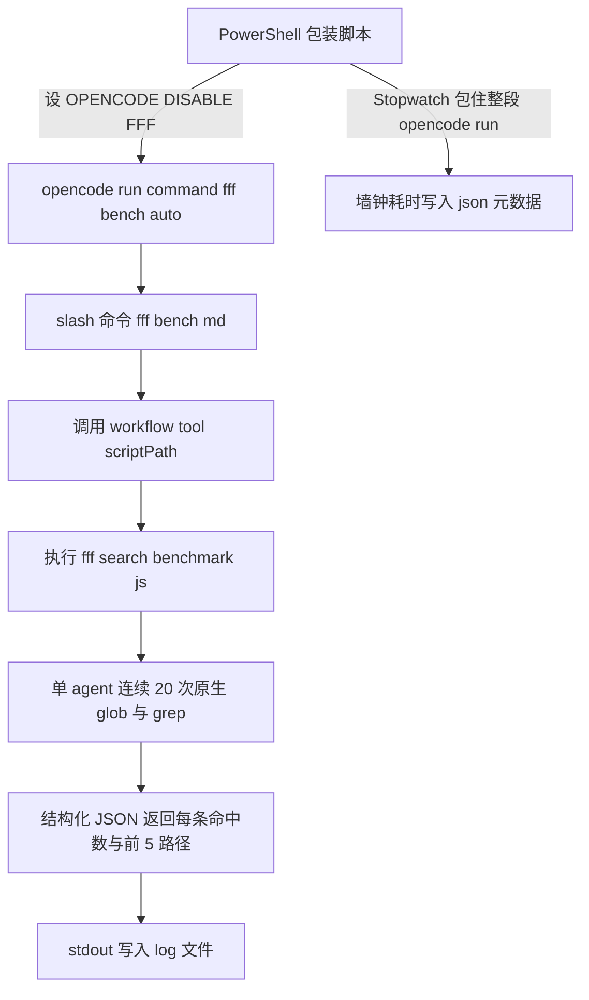

# FFF 文件搜索性能 A/B Benchmark 报告

> 目标:测量在同一项目/同一模型/同一 Agent 下,`OPENCODE_DISABLE_FFF` 开关(ripgrep vs fff)对 Agent 工作流的端到端耗时影响。
> 环境:Windows + OpenCode 1.18.30 + 插件 `opencode-dynamic-workflows`(本仓库)。模型 glm-5.2-high。
> 日期:2026-09-14(北京时间)。

## 1. 背景与目标

OpenCode 在 Windows 上默认禁用 FFF(Fast File Find)搜索后端,回退到 ripgrep。
本测试验证:**开启 FFF 后,Agent / Workflow 的实际体感性能是否有收益。**

分两层:
1. 第一层(本报告):Workflow 端到端 A/B —— 测 Agent 用户体感性能,含 LLM 延迟。
2. 第二层(后续):纯 `find/grep` benchmark —— 把 LLM 延迟排除,直测两后端搜索耗时。

## 2. 核实事实(均有本地源码证据,禁止发明 API)

| 事实 | 证据 |
|---|---|
| `OPENCODE_DISABLE_FFF` 环境变量真实存在 | `thirdparties/opencode/packages/core/src/flag/flag.ts:9,34` |
| Windows 默认禁用(env 未设时 `= process.platform === "win32"`) | `flag.ts:34` |
| `=1` → Flag 为 true → ripgrep 后端;`=0` → Flag 为 false → fff 后端(若 `Fff.available()`) | `thirdparties/opencode/packages/core/src/filesystem/search.ts:235` |
| fff 后端按会话目录 `basePath` 建索引,只索引会话目录 | `search.ts:128-133`(`Fff.create({ basePath: location.directory, ... })`) |
| workflow DSL 沙箱禁用 `Date.now()` / `new Date()` / `Math.random()`(文本级扫描,连注释里出现都拒) | `src/runtime/vm.ts:35-58` |
| workflow tool 的 `scriptPath` 相对项目目录解析,服务端读盘 | `src/tools/script-source.ts:30` |
| `opencode run --command <name> --auto` 调用 `.opencode/commands/<name>.md` | `thirdparties/opencode/packages/opencode/src/cli/cmd/run.ts`(`--command` 分支) |
| workflow 经插件注册的 `workflow` tool 触发 | `src/index.ts:24`(`workflow: createWorkflowTool(...)`) |

> 关键约束:因 workflow 沙箱禁用时间 API,**计时只能在 workflow 外层(外层 PowerShell 包住 `opencode run`)**完成。这决定了本测试的架构。

## 3. 基准设计

### 3.1 架构



设计要点:
- **单 agent 20 连测**(10 glob + 10 grep),减少多 agent 各自 LLM 预热的方差,让搜索后端耗时在总时长中累积到可观测量级。
- **每个 pattern 显式**,保证 A/B 两路 agent 行为一致,唯一变量是 `OPENCODE_DISABLE_FFF`。
- **计时在外层** `[System.Diagnostics.Stopwatch]` 包住 `opencode run`,绕开 workflow 沙箱的时间 API 禁令。
- **正解性校验**:每条查询返回 hits + 前 5 路径,A/B 两路 hits 应一致(差异即后端行为差异)。

### 3.2 文件清单(均在 `examples/sample-project/`)

| 文件 | 作用 |
|---|---|
| `.opencode/workflows/fff-search-benchmark.js` | 小项目版 workflow(目标为当前项目) |
| `.opencode/commands/fff-bench.md` | slash 命令,触发 workflow 并原样回传 JSON |
| `benchmarks/run-fff-bench.ps1` | 共享 runner:`-Mode on/off -ProjectDir`;用 `cmd /c` 原生重定向绕 PS 5.1 stderr 坑;Stopwatch 计时;存 `.log/.err/.json` |
| `benchmarks/run-fff-off.ps1` / `run-fff-on.ps1` | 一键包装脚本 |
| `benchmarks/run-fff-ab.ps1` | A/B 编排器:`-Runs -ProjectDir`;出对比表 + `ab-summary-*.json` |
| `benchmarks/large-target/` | 干净大目标项目(见 3.3) |

### 3.3 大树目标(避免污染第三方树)

fff 只索引会话目录,所以让 fff 索引大树必须把会话目录设在大树上。但直接在 `thirdparties/opencode`(OpenCode 自己的仓库,有自己的 `.opencode` 配置会冲突)跑会冲突。解法:

- 新建干净项目目录 `benchmarks/large-target/`,其 `opencode.json` 用 `"plugin": ["../../../../"]` 从仓库根加载本插件;
- 用 **Windows junction**(非 symlink,免管理员)把 `large-target/src` 指向 `thirdparties/opencode/packages`(6375 个源码文件,无 node_modules);
- 该目录自带 `fff-bench` 命令与 `fff-search-benchmark.js`(glob/grep 均传 `path="src"`,见发现 4.2)。

### 3.4 怎么跑

```powershell
# 单次单边
.\benchmarks\run-fff-off.ps1
.\benchmarks\run-fff-on.ps1

# 大树单边
.\benchmarks\run-fff-bench.ps1 -Mode off -ProjectDir 'benchmarks\large-target'
.\benchmarks\run-fff-bench.ps1 -Mode on  -ProjectDir 'benchmarks\large-target'

# A/B 多轮(大树)
.\benchmarks\run-fff-ab.ps1 -Runs 3 -ProjectDir 'benchmarks\large-target'
```

## 4. 关键发现

### 4.1 fff 在本机可用

`OPENCODE_DISABLE_FFF=0` 时 fff 后端真实启用(ON 轮 glob/grep 均返回真实结果)。`Fff.available()` 在本机返回 true。

### 4.2 fff 跟 junction,rg glob-from-root 不跟(重要)

- ON(fff)的 glob 用 pattern `src/**/*X*` 从项目根搜索,**能**遍历 junction 找到文件;
- OFF(rg)的 glob 用同样的 pattern 从项目根搜索,**跳过** junction reparse point,返回 0;
- 但 OFF(rg)的 grep 用 `path="src"`(cwd 解析进 junction 内部)时**能**正常搜索。

修复:glob 也改用 `path="src"` + pattern `**/*X*`,让 rg 的 cwd 也进 junction 内部,两路对称。
**结论:任何让 ripgrep 搜索 junction/挂载点的工作流,都必须用显式 `path=` 让 cwd 进入,不能靠从根目录的 pattern 隐式遍历。**

### 4.3 LLM 方差压倒搜索差异(核心结论)

- 大树 OFF 两次跑:428.78s(混淆版,glob 空跑)vs 268.10s(修复版,glob 真搜索,工作量更大却更快)—— **同模式两次差 160s**;
- 全部 20 次搜索的真实工作量估计仅 30-40s;
- 即:**单轮 A/B 的差距(几十秒)完全淹没在 LLM 轮次方差里,不能下结论**。

这正是第一层端到端测试的固有局限。要拿真信号,要么多轮取均值(见第 5 章),要么上第二层纯 `find/grep` benchmark(不经 agent)。

### 4.4 正确性

修复版大树单轮:OFF(rg)与 ON(fff)20 条查询 hits **完全一致**(60,3,100,43,41,100,53,100,36,7,68,0,0,100,100,100,100,100,100,100),A/B 对称有效。

> 注:`agent(`/`phase(`/`parallel(` 这类含未闭合括号的 pattern,跨轮出现过 0 vs 68 的波动,属 agent 对 `(` 转义处理的不稳定(非后端固有差异),单轮内两路一致。

## 5. 已执行运行汇总

| # | 目标 | Mode | 耗时(s) | exit | tag | 备注 |
|---|---|---|---:|---|---|---|
| 1 | 小项目 sample-project | off | 248.87 | 0 | - | 含 agent 自动修注释的额外 LLM 轮(混淆) |
| 2 | 小项目 sample-project | on | 156.76 | 0 | - | |
| 3 | 大树 large-target | off | 428.78 | 0 | large | rg glob 跳过 junction(混淆,工作量减半) |
| 4 | 大树 large-target | on | 461.44 | 0 | large | fff glob 走 junction |
| 5 | 大树 large-target(修复对称) | off | 268.10 | 0 | large-fixed | glob 改 path=src,20 真搜索,正确性 20/20 一致 |
| 6 | 大树 large-target(修复对称) | on | 305.10 | 0 | large-fixed | 同上;fff +13.8%(单轮,在噪声内) |

产物均落盘于 `benchmarks/large-target/results/`(或小项目的 `benchmarks/results/`),含 `fff-<mode>-run-<n>-<stamp>.log`(agent 打印的 JSON 搜索结果)+ `.json`(计时元数据)+ `.err`(stderr 留查)。

## 6. 三轮均值结果(大树 large-target,6375 文件)

> 命令:`.\benchmarks\run-fff-ab.ps1 -Runs 3 -ProjectDir 'benchmarks\large-target'`
> 实际耗时约 29 分钟(6 次 opencode run)。产物:`benchmarks/large-target/results/ab-summary-20260914-172857.json`。

| 模式 | Run 1 (ms) | Run 2 (ms) | Run 3 (ms) | 均值 (ms) | 备注 |
|---|---:|---:|---:|---:|---|
| OFF (ripgrep) | 236320 | 341592 | 306502 | 294805 | 极差 105s(约均值 36%) |
| ON (fff) | 338733 | 285000 | 236631 | 286788 | 极差 103s(约均值 36%) |
| delta | +102413 | -56592 | -69871 | **+8017** | fff 快 8.0s |
| 提升% | fff 慢 43.3% | fff 快 16.6% | fff 快 22.8% | **fff 快 2.7%** | |

### 6.1 统计分析

- 粗算标准差:OFF ≈ 45s,ON ≈ 51s(样本 n=3);
- 均值差 8.0s ≈ **0.2 个标准差**,远低于显著性门槛;
- 单轮方向不一致:Run 1 fff 反而慢 43%,Run 2/3 fff 才快 —— 典型的**随机波动而非稳定效应**;
- 结论:**在 6375 文件 + glm-5.2-high 这套组合下,fff 与 ripgrep 对端到端 Agent 工作流耗时无可测量差异,2.7% 完全淹没在 LLM 轮次方差里。**

### 6.2 正确性

3 轮均 exit=0。抽验 Run 3:OFF 与 ON 20 条查询 hits 基本一致(19/20 完全相同),仅 id=7 (`**/*plugin*`) OFF=52 / ON=56 差 4 个,属 fff 在未显式传 limit 时默认页大小截断 glob 结果的已知行为差异(见 `search.ts` fffLayer.glob 用 `pageSize: input.limit`,缺省时可能截断)。

## 7. 结论与建议

### 最终结论

1. **fff 在本机 Windows + opencode 1.18.30 可用且 `=0` 真实启用**,不会崩、不会静默回退。
2. **端到端体感性能:fff 与 rg 无显著差异**(3 轮均值 fff 快 2.7%,但 < 1σ,方向不稳)。对**一次性 `opencode run` 场景**,在 ~6000 文件量级下开启 fff **没有可感知收益**。
3. **瓶颈是 LLM 轮次,不是搜索后端**:20 次搜索的真实搜索工作量 ~30-40s,而单次 run 总耗 236-342s,LLM 占 >85%。优化搜索后端对端到端收益天花板很低。
4. **两后端行为有微小差异**:fff 的 glob 在未传 limit 时可能截断结果;rg 的 glob 从项目根不跟 junction/reparse point(必须显式 `path=`)。这些对正确性影响小但值得知晓。

### 建议

- **是否长期开启 fff**:本数据不支持"开了更快"的结论。若内存增长可接受、且主要在**长会话反复搜索**(warm 场景)下使用,可再测 warm 收益(见下);否则保持 Windows 默认(rg)即可。
- **测 warm 收益**(fff 索引复用):在同一会话内连续多次跑 workflow,用 `opencode run -c` 续会话,对比第 1 次(cold)与第 N 次(warm)。属 v2。
- **彻底排除 LLM 延迟**:上第二层纯 `find/grep` benchmark —— 不经 agent,直接对两后端跑 N 次 glob/grep 取均值,测的是纯搜索耗时,信号干净。这才是回答"fff 搜索本身快不快"的正确实验。
- **更大树**:如需测 fff 索引在大库的 cold 成本,把 junction 指向更大的树(注意排除 node_modules,fff 是否尊重 .gitignore 未在本测试验证)。

## 8. 参考引用

- 环境变量与后端选择:`thirdparties/opencode/packages/core/src/flag/flag.ts`、`thirdparties/opencode/packages/core/src/filesystem/search.ts`
- `opencode run --command`:`thirdparties/opencode/packages/opencode/src/cli/cmd/run.ts`
- workflow 沙箱禁用时间/随机 API:`src/runtime/vm.ts`
- workflow tool 与 scriptPath 解析:`src/tools/workflow.ts`、`src/tools/script-source.ts`
- 本仓库 AGENTS.md(事实来源与 API 约束):`AGENTS.md`
- OpenCode 官方插件文档:`thirdparties/opencode/packages/web/src/content/docs/plugins.mdx`
