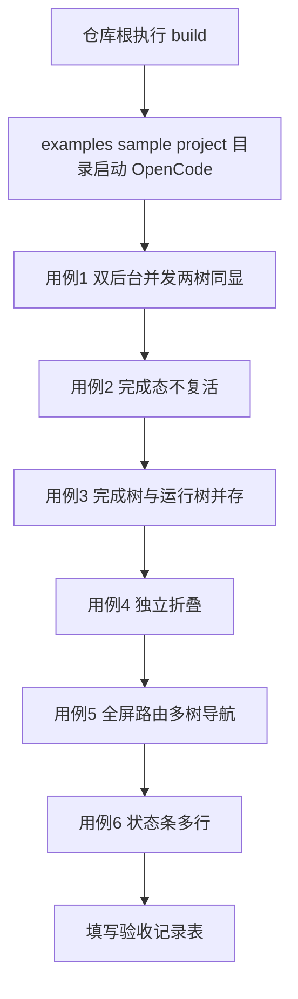

# 多树同显测试指南（workflow 多 run 同时显示）

> 测试工程：examples/sample-project（在本目录启动 OpenCode）
> 验收对象：sidebar 多棵 workflow 树同显（不再单树裁决切换）、后台心跳终态保持
> 背景问题：此前两个 workflow 并存时 sidebar 按 time 裁决只显示一棵，双活心跳交错导致显示在两棵树之间反复横跳，无法观察
> 前置阅读：examples/sample-project/TUI测试指南.md（单树时代的验收方式，本指南只覆盖多树新增行为）

---

## 目录

1. [测试流程总览](#1-测试流程总览)
2. [前置条件](#2-前置条件)
3. [用例 1 双后台 run 并发两树同显](#3-用例-1-双后台-run-并发两树同显)
4. [用例 2 完成态不复活](#4-用例-2-完成态不复活)
5. [用例 3 完成树与运行树长期并存](#5-用例-3-完成树与运行树长期并存)
6. [用例 4 独立折叠](#6-用例-4-独立折叠)
7. [用例 5 全屏路由多树导航](#7-用例-5-全屏路由多树导航)
8. [用例 6 状态条多行](#8-用例-6-状态条多行)
9. [排查清单](#9-排查清单)
10. [验收记录表](#10-验收记录表)

---

## 1. 测试流程总览

---

## 2. 前置条件

1. 仓库根执行 `npm run build`（server 侧 dist 需包含心跳修复与多树逻辑）
2. 确认 `examples/sample-project/scripts/` 下存在新增的两个脚本：
   - `multi-tree-a.js`（约 30 到 50 秒）
   - `multi-tree-b.js`（约 60 到 100 秒）
3. 在 `examples/sample-project` 目录启动 OpenCode TUI
4. 随便发一句话确认 sidebar 无 workflow 树（负向基线，同旧指南用例 6）

---

## 3. 用例 1 双后台 run 并发两树同显

> 验证核心问题：两个 workflow 同时运行时两棵树同时显示且各自独立刷新，不存在来回切换

步骤：

1. 对 Main Agent 说：
   `读取 scripts/multi-tree-a.js 的内容，用 workflow 工具原样执行并传 background: true，不要改动脚本`
2. 等 A 树出现且节点开始转动（约 5 秒），再对 Main Agent 说：
   `读取 scripts/multi-tree-b.js 的内容，用 workflow 工具原样执行并传 background: true，不要改动脚本`
3. 持续观察 sidebar 至少 30 秒

预期：

| 检查项 | 预期 |
| --- | --- |
| 树数量 | sidebar 同时出现 `multi_tree_a` 与 `multi_tree_b` 两棵树，各自带 `▼` 标题行 |
| 标题行内容 | 形如 `▼ multi_tree_a (0/4 | 3 running) | 1.2k tok`，两树标题不同名 |
| 独立刷新 | 两棵树的节点状态各自变化，互不影响 |
| 稳定性 | 任意时刻两棵树都在，**绝不出现一会儿只剩 A、一会儿只剩 B 的交替**（旧版横跳现象） |
| 位置稳定 | 新创建的树在上，后创建的在下，运行期间位置不互换（按 run 创建时间排序，不受心跳影响） |

---

## 4. 用例 2 完成态不复活

> 验证后台心跳修复：run 完成后结果回传主会话期间（可达数十秒），快照保持终态，不再被心跳覆写回 running

步骤：

1. 接用例 1，等 `multi_tree_a` 先完成（标题变为 `multi_tree_a (4/4)`，节点全部实心圆点）
2. A 完成后主会话会出现"后台工作流已完成"的回传消息，Main Agent 开始汇报
3. 在 Main Agent 汇报期间（十几秒到几十秒），持续盯着 `multi_tree_a` 的标题行

预期：

| 检查项 | 预期 |
| --- | --- |
| 状态保持 | A 树标题保持 `(4/4)` 无 `running` 后缀，节点保持实心，**不变回空心转动** |
| B 树不受干扰 | B 树继续独立刷新 |
| 回传完成后 | A 树依然以完成态显示 |

---

## 5. 用例 3 完成树与运行树长期并存

> 验证多树合并规则的失联过滤与终态常驻

步骤：

1. 接用例 2，等 B 也完成（两棵树均为完成态）
2. 再启动一次 A（同样提示词，`background: true`）
3. 观察 B 完成树与新一轮 A 运行树并存的全过程，直到新 A 完成

预期：

| 检查项 | 预期 |
| --- | --- |
| 并存 | B 完成树 + 新 A 运行树同时显示，各自标题行的计数独立 |
| 完成树常驻 | B 完成树不消失、不闪烁 |
| 新 A 完成 | 第三阶段两棵树均为完成态，`B (4/4)` 与 `A (4/4)` 并排 |

---

## 6. 用例 4 独立折叠

步骤：

1. 两棵树同显状态下，鼠标点击 A 树标题行
2. 再点击 B 树标题行
3. 再分别点击恢复展开

预期：

| 检查项 | 预期 |
| --- | --- |
| 单树折叠 | 点击谁谁折叠（`▼` 变 `▶`，节点收起），另一棵树不受影响 |
| 折叠记忆 | 折叠状态下轮询刷新（节点变化）不会把树重新展开 |
| 独立恢复 | 再次点击各自恢复展开，互不联动 |

---

## 7. 用例 5 全屏路由多树导航

步骤：

1. 两棵树同显状态下，命令面板执行 `workflow`（或 slash 输入 `/workflow`）打开全屏路由
2. 按 `j` 与 `k` 上下移动选中高亮
3. 从第一棵树最后一个节点继续按 `j`，确认选中进入第二棵树的节点
4. 选中一个带子会话的节点按 `Enter` 进入子会话，`Esc` 返回主会话
5. 全屏路由内按 `Esc` 或 `q` 返回

预期：

| 检查项 | 预期 |
| --- | --- |
| 多树平铺 | 全屏页按顺序平铺两棵树，每棵树有加粗标题行与 phase 分组行 |
| 跨树导航 | `j` 与 `k` 可跨树连续移动，首尾回绕 |
| 选中跟随 | 选中越出屏幕时列表自动滚动跟随 |
| Enter 导航 | 进入对应子会话；Esc 返回主会话后 sidebar 仍两树同显 |

---

## 8. 用例 6 状态条多行

步骤：

1. 用例 1 的两树并发运行期间，观察输入框右侧状态条
2. 等一棵完成后再次观察

预期：

| 检查项 | 预期 |
| --- | --- |
| 并发期 | 状态条同时显示两行，分别对应两个运行中的 workflow，如 `◐ workflow multi_tree_a 1/4 · 2 running` |
| 单运行期 | 只剩一行（仅运行中的显示） |
| 全部完成 | 状态条消失 |

---

## 9. 排查清单

| 现象 | 可能原因 | 处理 |
| --- | --- | --- |
| 两树仍交替出现 | 未重新 build，server 还是旧 dist | 仓库根 `npm run build` 后重启 OpenCode |
| 完成树短暂变回 running | 心跳修复未生效（旧 dist） | 同上；确认 `dist/tools/background-runs.js` 内心跳回调带 `status` 判断 |
| 某棵树消失不再出现 | 快照失联（running 超 8 秒无心跳）属正常过滤；终态树不应消失 | 检查 `.opencode-workflows/runs/` 目录内对应 runId 文件的 status 与 time |
| 折叠后树位置互换 | 不会发生：树位置按 run 创建时间降序（新在上旧在下），与心跳无关，位置稳定 | 无需处理 |
| 全屏路由只见一棵树 | 路由参数取当前会话，两 run 须同会话启动 | 确认两个 run 是在同一会话发起 |

---

## 10. 验收记录表

| 用例 | 结果（通过 或 失败） | 备注 |
| --- | --- | --- |
| 1 双后台并发两树同显 |  |  |
| 2 完成态不复活 |  |  |
| 3 完成树与运行树并存 |  |  |
| 4 独立折叠 |  |  |
| 5 全屏路由多树导航 |  |  |
| 6 状态条多行 |  |  |
