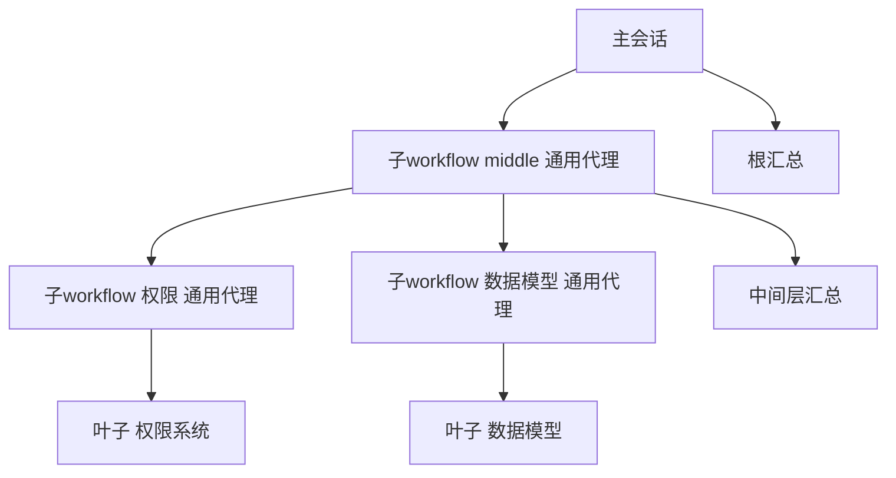

# 嵌套 workflow 测试指南

验证目标：workflow 能否在执行中再启动其他 workflow，串联成一个大的多层流程。

## 结论

| 路径 | 是否支持 | 说明 |
|------|---------|------|
| 脚本内直接嵌套（`workflow()` 全局） | 不支持 | VM 沙箱全局只有 agent/parallel/pipeline/phase/log/args/setConcurrency/verify/judgePanel/retry/checkpoint/console，runtime 头注释明确嵌套属 P1+ |
| `agent({agentType:'general'})` 子代理再调 `workflow` 工具 | 支持 | 内置 general 代理权限为 `"*": allow`（agent.ts），插件注册的 workflow 工具对它可用；explore 代理是 `"*": deny` 白名单制，无法调用 |

已实测通过：root -> middle -> leaf 三层串联，两批执行（CLI 批 + 手动批）均完整完成。

## 测试产物

- `scripts/chain-leaf.js`：叶子 workflow，单 agent 主题要点分析，支持 `args.topic` 下发
- `scripts/chain-middle.js`：中间层，parallel 两个 general 子代理各调 workflow 工具跑 leaf，再汇总
- `scripts/chain-root.js`：根，一个 general 子代理调 workflow 工具跑 middle，再总结
- `.opencode/commands/chain-nested.md`：非交互驱动命令

## 运行方式

CLI 无头模式（结果 JSON 打到 stdout）：

```
cd examples/sample-project
opencode run --command chain-nested --auto
```

TUI 手动模式：对 Main Agent 说"用 workflow 工具执行 scripts/chain-root.js，scriptPath 传该路径"。

## 验证手段

1. 最终输出：根返回的 JSON 里应包含 middle 的 leaves（两份 topic + leafSummary）与 report
2. journal：`.opencode-workflows/journal/` 应出现 4 个 runId（chain_root x1、chain_middle x1、chain_leaf x2），标签与 phase 对应
3. 会话树：opencode.db 的 session.parent_id 呈四层结构



4. TUI（B2 层级树）：主会话 sidebar 只显示顶层 root 树，嵌套 run 作为子树插在触发节点名下（缩进一级、細箭头、可独立折叠）；全屏 workflow 视图同构层级缩进，j/k 导航跨层可用；无父节点的孤儿 run 自动提升为顶层不隐藏


## 注意事项

- journal 是逐 agent 流式追加的：run 进行中读 journal 文件看到条目不全是正常现象，等终态再核对（易误判为丢失）
- explore 子代理调不了 workflow 工具（权限白名单）；嵌套调用必须显式 `agentType: 'general'`
- 嵌套子代理的 prompt 要写明：只传 scriptPath、不传 background 与 script（二选一规则）、等执行完成、结果 JSON 原样回传
- 嵌套层级无硬限制，无防递归保护；编排时自行控制深度，防止失控烧 token
- 每层嵌套各自独立 runId、独立 journal、独立快照，互不冲突；resume 亦是按各 runId 独立进行
